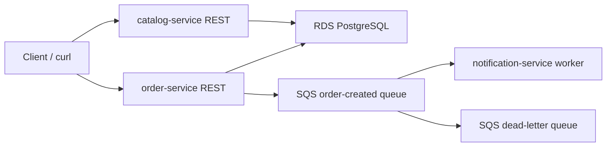

# Architecture

The selected reference architecture is the mini e-commerce backend from the
project statement.

Locally, PostgreSQL and SQS are represented by Docker Compose and LocalStack.
In AWS, Terraform provisions the VPC, EC2, RDS and SQS resources.

## Components

| Component | Responsibility | Runtime |
| --- | --- | --- |
| `catalog-service` | Product CRUD API | Docker container on EC2 |
| `order-service` | Order CRUD API and event producer | Docker container on EC2 |
| `notification-service` | SQS consumer and notification processor | Docker container on EC2 |
| RDS PostgreSQL | Persistent relational data | Private AWS subnet |
| SQS | Asynchronous order-created events | Managed AWS service |
| SQS DLQ | Failed message isolation after retries | Managed AWS service |

## Network Layout

- The VPC is created by Terraform.
- The EC2 instance is placed in a public subnet so the demo endpoints can be
  reached directly on ports `8081`, `8082` and `8083`.
- RDS is placed in private subnets and is not publicly accessible.
- PostgreSQL ingress is allowed only from the application security group.
- SSH access is restricted by the `allowed_ssh_cidr` Terraform variable.

## Request Flow

The async path is the main distributed-systems mechanism:

1. A client creates an order.
2. `order-service` persists the order.
3. `order-service` sends an `ORDER_CREATED` event to SQS.
4. `notification-service` polls SQS, processes the event and deletes the message.
5. Failed messages can be retried and eventually moved to the DLQ.

## Deployment Flow

1. GitHub Actions builds and publishes service images to GHCR.
2. Terraform provisions AWS infrastructure.
3. Ansible connects to the EC2 instance over SSH.
4. Ansible installs Docker and starts the production Docker Compose stack.
5. Services use environment variables generated from Terraform outputs and
   passed to the EC2 host.
